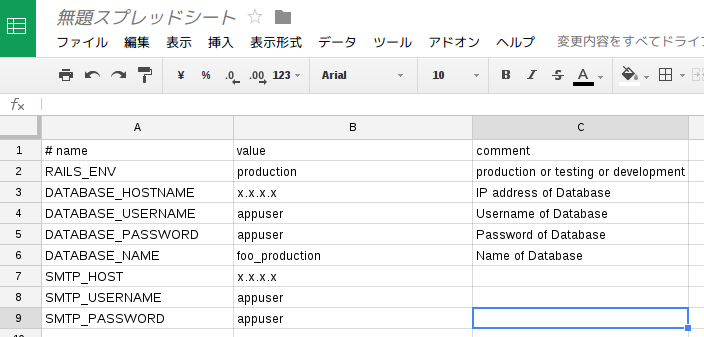

# DriveEnv

[](https://rubygems.org/gems/drive_env)
[](https://travis-ci.org/groovenauts/drive_env)

Generate `.env` file from Spreadsheet in Google Drive.

```
$ drive_env spreadsheet to_env 'https://docs.google.com/spreadsheets/d/*********/edit#gid=0'
# name value comment
RAILS_ENV=production # production or testing or development
DATABASE_HOSTNAME=x.x.x.x # IP address of Database
DATABASE_USERNAME=appuser # Username of Database
DATABASE_PASSWORD=appuser # Password of Database
DATABASE_NAME=foo_production # Name of Database
SMTP_HOST=x.x.x.x
SMTP_USERNAME=appuser
SMTP_PASSWORD=appuser
```

## Installation

Add this line to your application's Gemfile:

```ruby
gem 'drive_env'
```

And then execute:

    $ bundle

Or install it yourself as:

    $ gem install drive_env

## Usage

First, you need to login Google Cloud Platform and enable APIs.

1. Open https://console.developers.google.com/project
2. Create/Select project
3. Visit APIs & auth -> APIs
4. Grant access to `Drive API`
5. Visit APIs & auth -> Credentials
6. Oauth -> Create new Client ID
7. Choose Installed application (Other)
8. Note CLIENT ID, CLIENT_SECRET

Setup client_id, client_secret, and login.

```
$ drive_env config set client_id YOUR_CLIENT_ID
$ drive_env config set client_secret YOUR_CLIENT_SECRET
$ drive_env auth login
```

Now you have access token and refresh token, you can access to Google APIs.

Show Spreadsheet in Google Drive:

```
$ drive_env spreadsheet show 'https://docs.google.com/spreadsheets/d/*********/edit#gid=0'
```

You can add alias for Spreadsheet.

```
$ drive_env spreadsheet alias sheet1 'https://docs.google.com/spreadsheets/d/*********/edit#gid=0'
$ drive_env spreadsheet show sheet1
```

### `drive_env spreadsheet to_env`

`drive_env spreadsheet to_env` with following Spreadsheet



will generate dotenv gem friendly format.

```
$ drive_env spreadsheet to_env sheet1
# name value comment
RAILS_ENV=production # production or testing or development
DATABASE_HOSTNAME=x.x.x.x # IP address of Database
DATABASE_USERNAME=appuser # Username of Database
DATABASE_PASSWORD=appuser # Password of Database
DATABASE_NAME=foo_production # Name of Database
SMTP_HOST=x.x.x.x
SMTP_USERNAME=appuser
SMTP_PASSWORD=appuser
```

Redirect to file `.env`, and then you can use with dotenv gem.

```
$ drive_env spreadsheet to_env sheet1 > .env
$ your-ruby-application-with-dotenv-gem
```

## Integrate with Rails, Capistrano, and Dotenv

### Setup

Add `drive_env`, `dotenv` gem to Gemfile:

```ruby
gem "dotenv-rails", require: "dotenv/rails-now"

gem "drive_env", group: :development
```

Add `require "drive_env/capistrano"` to Capfile:

```ruby
require "drive_env/capistrano"
```

Add `.env` file to `:linked_files` in config/deploy.rb:

```ruby
append, :linked_files, ".env"
```

And set spreadsheet url in config/deploy/STAGE.rb:

```ruby
set :drive_env_spreadsheet_url, 'https://docs.google.com/spreadsheets/d/*********/edit#gid=0'
```

### Deployment with drive_env

1. Generate `config/deploy/#{STAGE}.env` file from spreadsheet
2. Upload `config/deploy/#{STAGE}.env` to `#{shared_path}/.env`
3. Deploy

```shell
bundle exec cap STAGE drive_env:to_env
bundle exec cap STAGE drive_env:upload
bundle exec cap STAGE deploy
```

## Development

After checking out the repo, run `bin/setup` to install dependencies. Then, run `rake rspec` to run the tests. You can also run `bin/console` for an interactive prompt that will allow you to experiment.

To install this gem onto your local machine, run `bundle exec rake install`. To release a new version, update the version number in `version.rb`, and then run `bundle exec rake release`, which will create a git tag for the version, push git commits and tags, and push the `.gem` file to [rubygems.org](https://rubygems.org).

## Contributing

Bug reports and pull requests are welcome on GitHub at https://github.com/groovenauts/drive_env.


## License

The gem is available as open source under the terms of the [MIT License](http://opensource.org/licenses/MIT).

